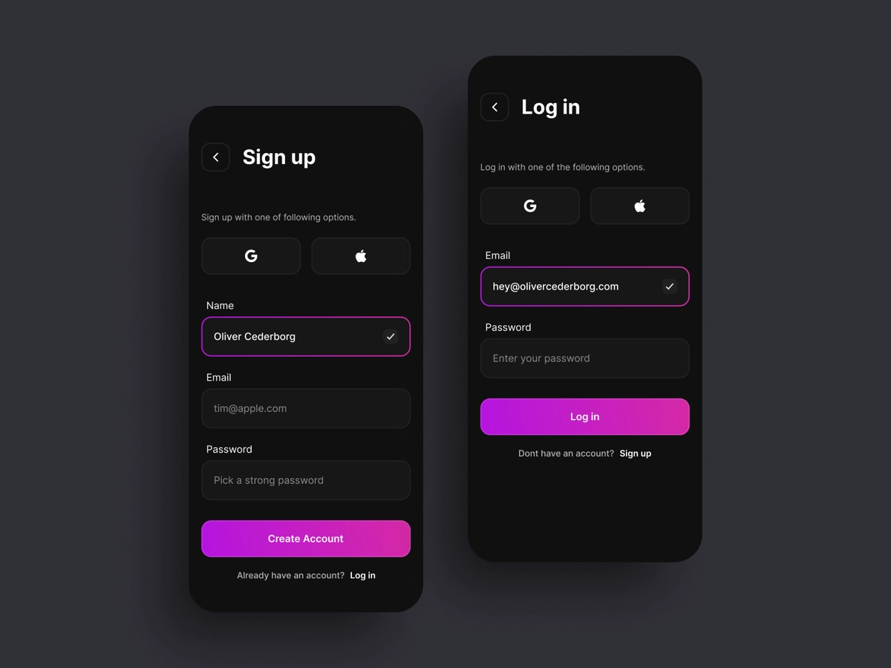

## Flutter Day 05

_Learn_
Form Validation, Local authentication

_Task_

### Todo-1
- create a login form and signup form (same as the given image)
- validate input field onSubmit the button
  - Validate correct email format
  - name only contains alphabets and spaces
  - password must 6 chars
- use Form widget and validator function

### Todo-2
- save the user credentials in locally using prefs
- authenticate the data while login
- then show the welcome screen

### App Flow
- User Enters his data on signup form
- Then login with the same data
- After succesfull authentication navigate to home screen
- if user already loggedin don't show the forms again after reload

