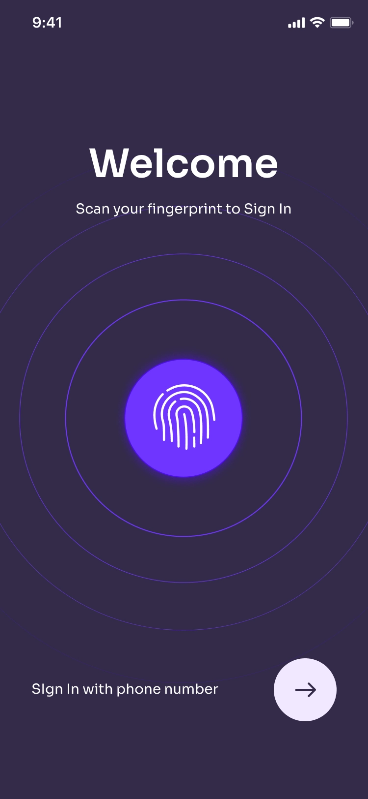

Flutter Day 9

Screen Development

- Create app screen similar as the given image
- use sliding carousel animation on homescreen
- use pulse effect in welcome screen (CustomPaint class)

<details>
<summary>Use this code for Pulse animation</summary>

```dart
AnimationController? _controller;

@override
void initState() {
  super.initState();
  _controller = new AnimationController(
    vsync: this,
  );
  _startAnimation();
}

@override
void dispose() {
  _controller!.dispose();
  super.dispose();
}

void _startAnimation() {
  _controller!.stop();
  _controller!.reset();
  _controller!.repeat(
    period: Duration(seconds: 2),
  );
}

Container(
height: MediaQuery.of(context).size.height,
width: MediaQuery.of(context).size.width,
color: Colors.black,
child: CustomPaint(
  painter: SpritePainter(_controller!),
  child: SizedBox(
    width: MediaQuery.of(context).size.width - 30,
    height: MediaQuery.of(context).size.width - 30,
  ),
),
alignment: Alignment.center,
),
```

```dart
import 'dart:math';

import 'package:flutter/material.dart';

class SpritePainter extends CustomPainter {
  final Animation<double> _animation;

  SpritePainter(this._animation) : super(repaint: _animation);

  void circle(Canvas canvas, Rect rect, double value) {
    double opacity = (1.0 - (value / 4.0)).clamp(0.0, 1.0);
    Color color = Color.fromRGBO(255, 255, 255, opacity);
    double size = rect.width / 2;
    double area = size * size;
    double radius = sqrt(area * value / 4);
    final Paint paint = Paint()
      ..color = color
      ..style = PaintingStyle.stroke
      ..strokeWidth = 1;
    canvas.drawCircle(rect.center, radius, paint);
  }

  @override
  void paint(Canvas canvas, Size size) {
    Rect rect = Rect.fromLTRB(0.0, 0.0, size.width, size.height);
    for (int wave = 3; wave >= 0; wave--) {
      circle(canvas, rect, wave + _animation.value);
    }
  }

  @override
  bool shouldRepaint(SpritePainter oldDelegate) {
    return true;
  }
}
```
</details>



